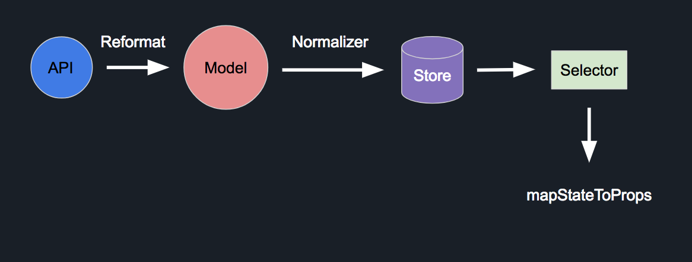

# Redux Model



Data Modeling in Reducer

## Table Content
* [Syntax](#syntax)
* [Create New Model](#create-new-model)
* [Set Validation in PropTypes](#set-validation-in-proptypes)
* [Usage in Action Creator](#usage-in-action-creator)
* [Usage in Selector](#usage-in-selector)
* [Usage in Component](#usage-in-component)


### Syntax
```js
(static) table = String
(static) isRequired = Object<Boolean>

(static) set(data) => Object
(static) get(data) => Object
(static) setPropTypes() => PropTypes.shape({})
(static) setDefaultProps() => Object
(static) faker() => Object 
(static) fakerList(num) => Array
(static) propTypes(data) => { string, number, bool, array, object, timestamp }
```

### Create New Model

Create new model in this project

1. Create New File

**Shortcut**
```sh
modular make:model <name>
```

2. Set data Model & Faker in this file

**Example**
```js
export class Purchase extends Model {
  ...

  static set(data) {
    const { string, array, object, timestamp } = this.propTypes(data)
    return {
      id: string('id'),
      status: string('status'),
      deliveryType: string('delivery_method.delivery_type'),
      paymentMethod: string('payment_method'),
      paymentCreditCard: string('payment_account.brand', '', false),
      paymentCreditCardID: string('payment_account.last4', '', false),
      userId: string('user_id'),
      currency: string('currency.symbol'),
      orderNo: string('order_no'),
      shop: Shop.set(object('shop')),
      customer: Customer.set(object('customer')),
      products: array('items').map(item => Product.set(item)),
      histories: array('histories'),
      createdAt: timestamp('created_at'),
      updatedAt: timestamp('updated_at'),
    }
  }

  static faker() {
    return {
      id: `purchase:${Alphabet.random(5)}`,
      status: 'processing',
      deliveryType: 'meetup',
      paymentMethod: '',
      paymentCreditCard: '',
      paymentCreditCardID: '',
      userId: `user:${Alphabet.random(5)}`,
      currency: '$',
      orderNo: Alphabet.random(10),
      shop: Shop.faker(),
      customer: Customer.faker(),
      products: Product.fakerList(2),
      histories: []
      createdAt: new Date().getTime(),
      updatedAt: new Date().getTime(),
    }
  }
}
```

### Set Validation in PropTypes

If you won't to set `isRequired` in PropTypes. Please create `static isRequired = {}` in Model

```js
export class Purchase extends Model {
  ...
  static isRequired = {
    description: false
  }
}
```

### Usage in Action Creator

**Set faker data in Action Creator**
```js
export const fetchPurchaseListRequest = () => ({ type: FETCH_PURCHASE_LIST.REQUEST }) 
export const fetchPurchaseListSuccess = (data) => ({ type: FETCH_PURCHASE_LIST.SUCCESS, data }) 
export const fetchPurchaseListFailure = (error) => ({ type: FETCH_PURCHASE_LIST.FAILURE, error }) 
export const fetchPurchaseList = () => (dispatch) => {
  dispatch(fetchPurchaseListRequest())
  dispatch(fetchPurchaseListSuccess(Model.fakerList(10)))
  // dispatch(fetchPurchaseListRequest())
  // return axios({
  //   method: 'GET',
  //   responseType: 'json',
  //   url: API_ENDPOINT_PURCHASE_LIST(),
  // })
  //   .then(res => dispatch(fetchPurchaseListSuccess(res.data.data)))
  //   .catch(error => dispatch(fetchPurchaseListFailure(error)))
}

export const fetchPurchaseDetailRequest = (key) => ({ type: FETCH_PURCHASE_DETAIL.REQUEST, key }) 
export const fetchPurchaseDetailSuccess = (data, key) => ({ type: FETCH_PURCHASE_DETAIL.SUCCESS, data, key }) 
export const fetchPurchaseDetailFailure = (error, key) => ({ type: FETCH_PURCHASE_DETAIL.FAILURE, error, key }) 
export const fetchPurchaseDetail = (key) => (dispatch) => {
  dispatch(fetchPurchaseDetailRequest(key))
  dispatch(fetchPurchaseDetailSuccess(Model.faker(), key))
  // dispatch(fetchPurchaseDetailRequest(key))
  // return axios({
  //   method: 'GET',
  //   responseType: 'json',
  //   url: API_ENDPOINT_PURCHASE_DETAIL(key),
  // })
  //   .then(res => dispatch(fetchPurchaseDetailSuccess(res.data.data, key)))
  //   .catch(error => dispatch(fetchPurchaseDetailFailure(error, key)))
}
```

### Usage in Selector

set defaultProps with `Model.setDefaultProps()`

```js
import { Purchase as Model } from '../models/Purchase'

export class PurchaseSelector {
  // Default data in Key value
  static defaultKeys = {
    isFetching: false,
    isReload: true,
    error: '',
    data: Model.setDefaultProps(), // set DefaultProps
  }
}
```

### Usage in Component

set propTypes with `Model.setPropTypes()`

create Model helper with `Model.get(data)` (NOTE: Don't Need to use it every time)

```js
import { Purchase as Model } from '../models/Purchase'

class PurchaseContainer extends Component {
  static propTypes = {
    purchase: PropTypes.shape({
      isFetching: PropTypes.bool,
      isReload: PropTypes.bool,
      error: PropTypes.string,
      data: Model.setPropTypes(), // set prop types
    }).isRequired,
  }
  ...
  render() {
    const { purchase } = this.props
    // create Model helper (NOTE: Don't Need to use it every time)
    const data = Model.get(purchase.data)
    return (
      ...
    )
  }
}
```